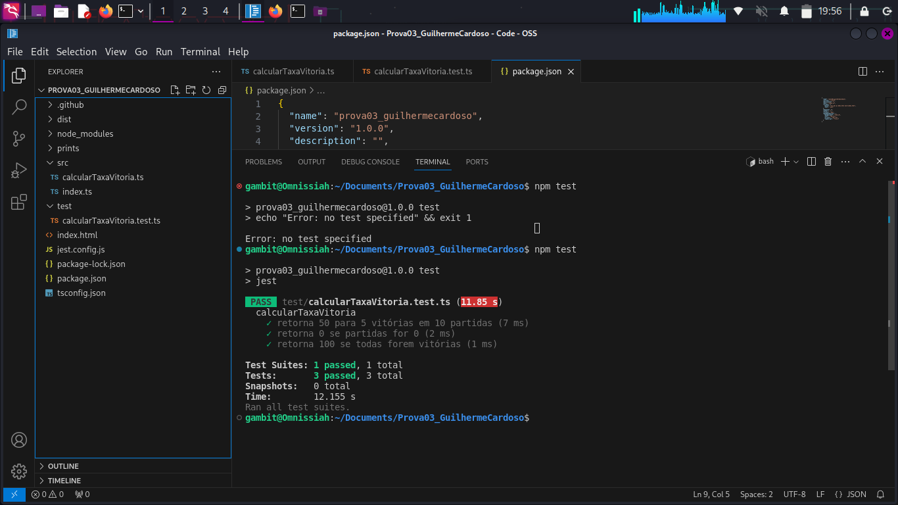
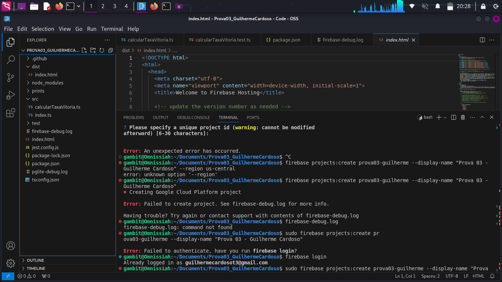
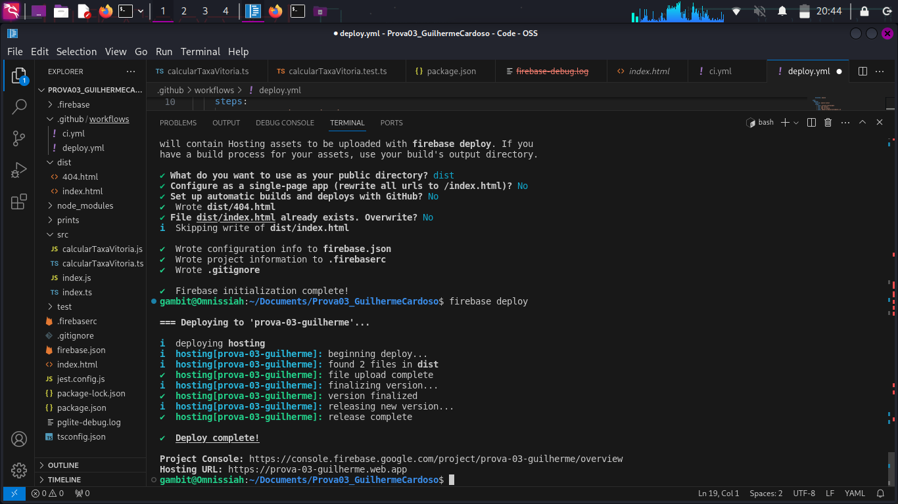

# 🚀 Projeto de Integração e Entrega Contínua

> 📚 **Disciplina:** Integração e Entrega Contínua — DSM  
> 👩‍🏫 **Professora:** Lucineide  
> 🧑‍💻 **Autores:** Guilherme Teixeira Cardoso e Rafael Soares de Moraes  
> 📅 **Data de entrega:** 27/06/2025  

---

## 🌱 1. Fluxo de Versionamento com Git e GitHub

A organização do versionamento de código é essencial para permitir que múltiplos desenvolvedores trabalhem simultaneamente sem conflitos. Para isso, adotamos um fluxo de branches (ramificações) inspirado no Git Flow.

---

## ⚙️ 2. Integração Contínua com GitHub Actions

**Integração contínua (CI)** é a prática de automatizar a construção e os testes de um projeto sempre que há alterações no repositório.

### 🔧 Como funciona:

Criamos um arquivo `ci.yml` dentro do diretório `.github/workflows` com as instruções para executar a pipeline automaticamente.

```yaml
name: CI Pipeline

on:
  push:
    branches: [ "main", "dev" ]
  pull_request:
    branches: [ "main", "dev" ]

jobs:
  build-and-test:
    runs-on: ubuntu-latest
    steps:
      - uses: actions/checkout@v3
      - uses: actions/setup-node@v4
        with:
          node-version: '18'
      - run: npm install
      - run: npm test
````

### ✅ O que ele faz:

1. Executa quando há push ou pull request nas branches `main` ou `dev`.
2. Instala as dependências do projeto com `npm install`.
3. Executa os testes automatizados com `npm test`.

---

## 🧪 3. Testes Automatizados com Jest

**Testes automatizados** verificam se as funções do sistema estão funcionando como esperado. Utilizamos o framework **Jest** para isso.

### 📌 Função testada

```ts
export function calcularTaxaVitoria(vitorias: number, partidas: number): number {
  if (partidas === 0) return 0;
  return (vitorias / partidas) * 100;
}
```

Essa função retorna a taxa de vitórias de um jogador. Exemplo: 5 vitórias em 10 partidas = 50%.

### ✅ Testes criados:

```ts
describe('calcularTaxaVitoria', () => {
  it('retorna 50 para 5 vitórias em 10 partidas', () => {
    expect(calcularTaxaVitoria(5, 10)).toBe(50);
  });

  it('retorna 0 se partidas for 0', () => {
    expect(calcularTaxaVitoria(5, 0)).toBe(0);
  });

  it('retorna 100 se todas as partidas forem vitórias', () => {
    expect(calcularTaxaVitoria(10, 10)).toBe(100);
  });
});
```

Com esses testes, garantimos que a função se comporta corretamente em casos comuns e extremos.



---

## 📋 4. Logging com Firebase

**Logging** consiste em registrar eventos importantes da aplicação, como acessos, erros ou operações críticas.

### 🧠 Por que usar logs?

* Ajudam a identificar problemas.
* Permitem auditoria de ações.
* Facilitam o monitoramento em produção.

### ✅ Boas práticas:

* Use `console.log()` para informações normais.
* Use `console.error()` para erros.
* Sempre inclua contexto (ex: ID do usuário, timestamp).

### 📌 Exemplo:

```ts
console.log(`[INFO] Usuário ${uid} logado às ${new Date().toISOString()}`);
console.error('[ERROR] Falha:', err);
```

> Os logs são visualizados no **Firebase Console > Functions > Logs**



---

## 🚀 5. Deploy Contínuo com Firebase Hosting

**Deploy contínuo** significa que toda alteração aprovada é automaticamente publicada no servidor, mantendo a aplicação atualizada sem intervenção manual.

### 🧭 Etapas para configurar:

1. Instalar ferramentas Firebase:

   ```bash
   npm install -g firebase-tools
   ```

2. Inicializar o projeto com suporte a Hosting:

   ```bash
   firebase init hosting
   ```

3. Definir:

   * Pasta pública: geralmente `build` ou `dist`
   * Ativar Single Page Application (SPA)

4. Gerar um token:

   ```bash
   firebase login:ci
   ```

5. Adicionar esse token no GitHub como segredo com nome `FIREBASE_TOKEN`.

### 📂 Arquivo `deploy.yml` para deploy automático:

```yaml
name: Deploy Firebase Hosting

on:
  push:
    branches: [main]

jobs:
  deploy:
    runs-on: ubuntu-latest
    steps:
      - uses: actions/checkout@v3
      - run: npm install
      - run: npm run build
      - uses: w9jds/firebase-action@v13.2.0
        with:
          args: deploy --only hosting
        env:
          FIREBASE_TOKEN: ${{ secrets.FIREBASE_TOKEN }}
```

> Toda vez que a branch `main` recebe uma alteração, o Firebase faz o deploy automaticamente.


